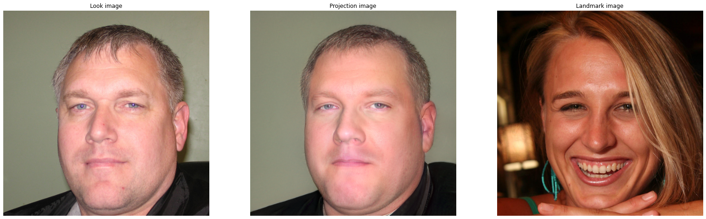
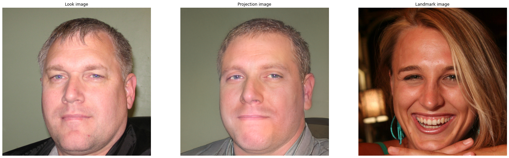
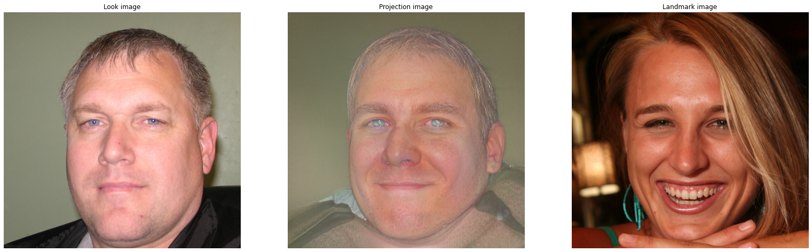
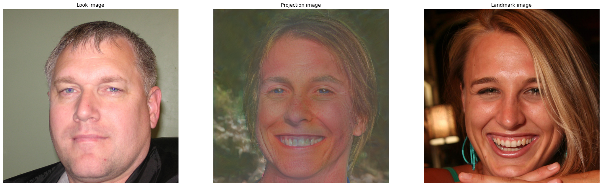

## StyleGAN2 Facial Landmark Projection

This is an experimental repository with the aim to project facial landmark into the StyleGAN2 latent space. The code is from the original StyleGAN2 repository [0]. For projection of facial landmarks, the l2 norm of the landmark heatmaps between projection image and target landmark image is minimized, next to the original LPIPS loss [2]. For heatmaps of the landmarks, [1] is used. The objective, thus becomes:

$loss = \lambda_{lpips} LPIPS(x_{projection}, x_{target\_look})  + \lambda_{landmark}HL(x_{projection}, x_{target\_landmark}) $, with $HL$ being the heatmap loss defined as $HL(x_1, x_2) = \sqrt{\sum_i^N (FAN(x_1) - FAN(x_2))^2}$, where $FAN$ is the landmark extraction model, and $N$ the number of pixels. LPIPS as in [1, 2].

Currently the image quality deteriorates quite heavily, when $\lambda_{landmark}$ becomes too big. The LPIPS weight is better kept at 1: $\lambda_{lpips} = 1$. This repository is work in progress. Happy about input.


## How to use

For quick testing, you can run this repository in Google Colab. Check it out [here](https://colab.research.google.com/drive/189Yc3zBvuGKdxyS_vOD5q6slqVu1qWR_?usp=sharing). Otherwise, install dependencies

```bash
pip install click requests tqdm pyspng ninja imageio-ffmpeg==0.4.3 face_alignment
```

and run it like so:

```bash
!python projector.py --lpips_weight=1 --landmark_weight=0.01 --device=cuda --num-steps=1000 --outdir=./ --target_look=./look_img.png --target_landmarks=./landmark_img.png --save_video=1  --network=https://nvlabs-fi-cdn.nvidia.com/stylegan2-ada-pytorch/pretrained/ffhq.pkl
```


## Examples

$\lambda_{landmark} = 0$ - Nothing



$\lambda_{landmark} = 0.01$ - Little smirk



$\lambda_{landmark} = 0.05$ - Smiling, but bad quality



$\lambda_{landmark} = 0.1$ - Laughing, but very bad quality




## Todos:

- Allow for different landmark weights via command line. This will probably improve the above example.
- Attempt to remove landmark information from VGG embedding for lpips calculation.


## References

[0]: Karras, Tero, et al. "Training generative adversarial networks with limited data." *arXiv preprint arXiv:2006.06676* (2020). Code: https://github.com/NVlabs/stylegan2-ada-pytorch

[1]: Bulat, Adrian, and Georgios  Tzimiropoulos. "How far are we from solving the 2d & 3d face  alignment problem?(and a dataset of 230,000 3d facial landmarks)." *Proceedings of the IEEE International Conference on Computer Vision*. 2017. Code: https://github.com/1adrianb/face-alignment

[2]: Zhang, Richard, et al. "The unreasonable effectiveness of deep features as a perceptual metric." *Proceedings of the IEEE conference on computer vision and pattern recognition*. 2018.


## License

Copyright &copy; 2021, NVIDIA Corporation. All rights reserved.

This work is made available under the [Nvidia Source Code License](https://nvlabs.github.io/stylegan2-ada-pytorch/license.html).


