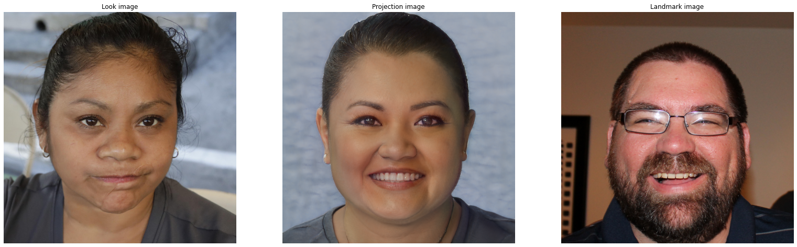
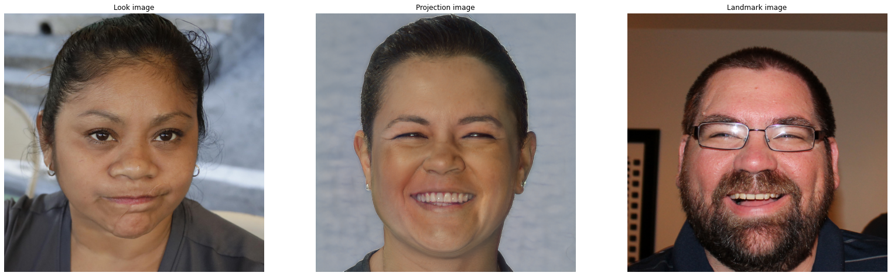

**You can also generate face animations now. Check this [blog post](https://lukas.uzolas.com/blog/2021/animation/) to find out how.**

[Google Colab](https://colab.research.google.com/drive/189Yc3zBvuGKdxyS_vOD5q6slqVu1qWR_?usp=sharing)

## StyleGAN2 Facial Landmark Projection

This is an experimental repository with the aim to project facial landmark into the StyleGAN2 latent space. The code is an adaptation from the original [StyleGAN2-ADA repository](https://github.com/NVlabs/stylegan2-ada-pytorch) [0]. For projection of facial landmarks, the l2 norm of the landmark heat maps between projection image and target landmark image is minimized, next to the original LPIPS loss [2]. For heat maps of the landmarks, [1] is used. Thus, there are two target images, one for the *look* and one for the *landmarks*. The objective becomes (noise regularization omitted):

, 

with ***HL*** being the heat map loss defined as 

, 

where *N*  is the number of pixels, and ***FAN*** is the landmark heat map extraction model which outputs a three-dimensional matrix, where the depth dimension encodes each single landmark. LPIPS as in [1, 2]. The factor  is a **vector** containing the weights for each group of landmarks. Groups are for example: Eye brows, eyes, mouth, etc. Check [1] for more info. By tweaking this vector you can determine what facial features you want to project **more strongly** into the generated images. See below for an example.

This repository is work in progress. Happy about input and contributions.

## How to use

For quick testing, you can run this repository in Google Colab. Check it out [here](https://colab.research.google.com/drive/189Yc3zBvuGKdxyS_vOD5q6slqVu1qWR_?usp=sharing). Otherwise, install dependencies

```bash
pip install click requests tqdm pyspng ninja imageio-ffmpeg==0.4.3 face_alignment
```

and run it like so:

```bash
python projector.py --lpips_weight=1 --landmark_weight=0.05 --device=cuda --num-steps=1000 --outdir=./ --target_look=./look_img.png --target_landmarks=./landmark_img.png --save_video=1  --network=https://nvlabs-fi-cdn.nvidia.com/stylegan2-ada-pytorch/pretrained/ffhq.pkl
```


## Examples

Almost no weighting of eyes in  vector, strong focus on mouth area:


<hr/>

Here the facial landmarks are weighted mostly uniformly:



Images from [FFHQ](https://github.com/NVlabs/ffhq-dataset) data set.

## Todos:

- ~~Allow for different landmark weights via command line. This will probably improve the above example.~~
- ~~Check out why the style look of the facial expression image leaks into the projection. Apparently the heat maps contain some "style" signal~~ (normalization factor in heat map calculation was the culprit, seems to work quite well now. This also improved quality of generated images immensely)
- ~~Add face cropping as preprocessing for non ffhq images~~
- ~~Face cropping does not match completly ffhq preprocessing, also uniform background are degrading results strongly. Improve face cropping.~~
- Add discriminator loss / regularization. Heat maps are some times wrongly extracted resulting in a **very** wrongly propagated error
- Attempt to remove landmark information from VGG embedding for lpips calculation.


## References

[0]: Karras, Tero, et al. "Training generative adversarial networks with limited data." *arXiv preprint arXiv:2006.06676* (2020). Code: https://github.com/NVlabs/stylegan2-ada-pytorch

[1]: Bulat, Adrian, and Georgios  Tzimiropoulos. "How far are we from solving the 2d & 3d face  alignment problem?(and a dataset of 230,000 3d facial landmarks)." *Proceedings of the IEEE International Conference on Computer Vision*. 2017. Code: https://github.com/1adrianb/face-alignment

[2]: Zhang, Richard, et al. "The unreasonable effectiveness of deep features as a perceptual metric." *Proceedings of the IEEE conference on computer vision and pattern recognition*. 2018.


## License

*This repository is mainly based on the orignal StyleGAN2-ADA code, thus the NVIDIA license applies.*  


Copyright &copy; 2021, NVIDIA Corporation. All rights reserved.

This work is made available under the [Nvidia Source Code License](https://nvlabs.github.io/stylegan2-ada-pytorch/license.html).


